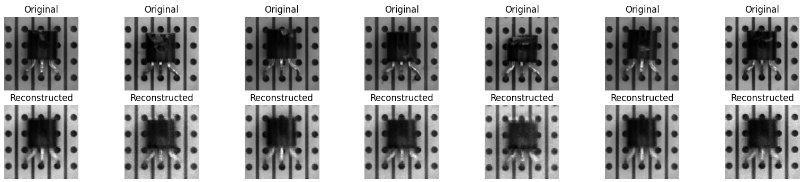
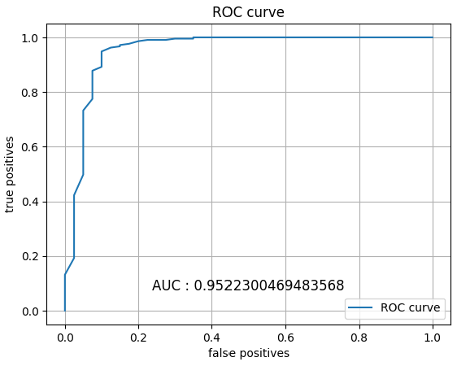

## Abstract

Anomaly detection is a challenging task, and is of great promise for improving industrial quality control. One could think finding out that an image is abnormal might be done by comparing a test image with a normal image. However, this is without considering all possibilities of what a normal image could look like. Because of shape, color, position, luminosity, pixel resolution and other parameters, a normal dataset can be very sparse. Our approach tackles such issues by proposing an encoder method. We compared different methods of compression and tried to reconstruct images, comparing input and output.  We therefore offer a robust pipeline to make a conclusion out of an image. Firstly, we provide a background section in order to understand the concepts we are working with. Then, we discuss the PCA encoder method and compare our own algorithm with the scikit-learn function. The third section is dedicated to the auto-encoder method using deep neural-networks. Finally, we explore the more complex architecture of convolutional auto-encoder and compare the results with the two previous methods. To the best of our knowledge, our convolutional method outperforms every other algorithm on this specific dataset. The goal of each method is to reconstruct normal images as accurately as possible, and to unaccurately reconstruct abnormal images.

## Illustration

Reconstructed damaged transistors from MVTec dataset:

AUC result for the binary classification:

